<div align="center">

# MyMisu OS

**A bare-metal x86 operating system built from scratch in C and Assembly**

[](https://github.com/Brago475/myMisu_OS/releases/latest)

[](https://github.com/Brago475/myMisu_OS/releases)
[]()
[-green?style=flat-square)]()
[](https://github.com/Brago475/myMisu_OS/stargazers)

<br>

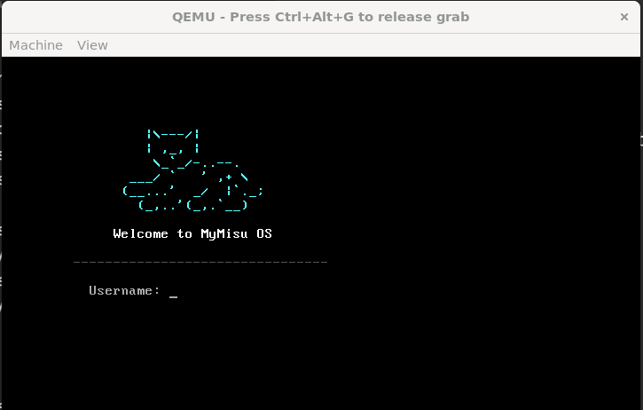

*MyMisu OS login screen — boots on real hardware via USB*

</div>

---

## About

MyMisu OS is a fully functional operating system that runs directly on x86 hardware without any underlying OS, runtime, or standard library. It is written entirely in C and x86 assembly, compiled with a freestanding GCC cross-compiler, and boots via GRUB Multiboot.

The OS includes a login system, interactive shell with 35+ commands, a ramdisk filesystem with file and directory support, process management with a process table, a physical memory allocator, five system calls accessible via software interrupt, a text editor, seven games, and multiple visual UI applications including a file browser, system monitor, and desktop widget dashboard.

Named after Misu, a cat.

---

## Download and Run

### Download

Go to the [Releases](https://github.com/Brago475/myMisu_OS/releases/latest) page and download **mymisu.iso** (4.93 MB).

### Run in QEMU

```bash
qemu-system-i386 -cdrom mymisu.iso -m 128M
```

### Boot on Real Hardware

1. Download [Rufus](https://rufus.ie) on Windows
2. Insert a USB drive
3. Open Rufus, select `mymisu.iso`, and flash it to the USB
4. Restart your computer and boot from the USB drive (press F2, F12, or DEL at startup to enter boot menu)
5. MyMisu OS will boot directly on your hardware

### Run in a Virtual Machine

Create a virtual machine in VirtualBox, VMware, or Proxmox. Attach `mymisu.iso` as a CD/DVD image. Allocate at least 128 MB of RAM and 1 CPU core. Start the VM.

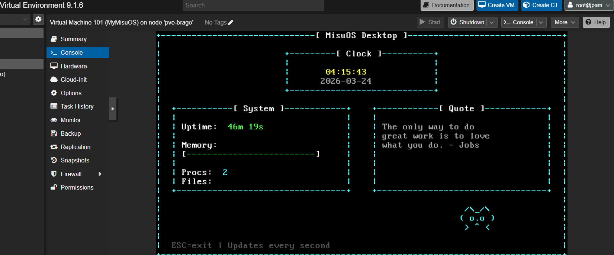

*MyMisu OS running on a Proxmox virtualization server*

### Login Credentials

| Username | Password |
|----------|----------|
| misu | misu |
| admin | admin |
| james | 1234 |

---

## Boot Sequence

When the OS starts, an animated boot sequence plays: the cat ASCII art draws in line by line, the title types out letter by letter, and a loading bar fills showing each subsystem initializing. After the animation, the login screen appears with the cat logo and authentication prompt. Passwords are masked with asterisks.

After login, the kernel displays initialization status for each subsystem.

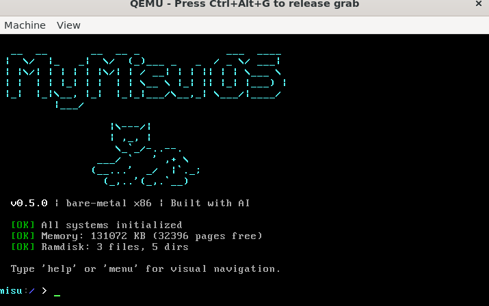

*Boot screen showing all subsystems initialized*

---

## Shell

After logging in, you enter the MisuOS shell. The prompt shows `misu:/ >` with the current directory name. The shell supports command history (UP/DOWN arrows cycle through previous commands), backspace editing, and argument parsing. Type `help` to see all available commands.

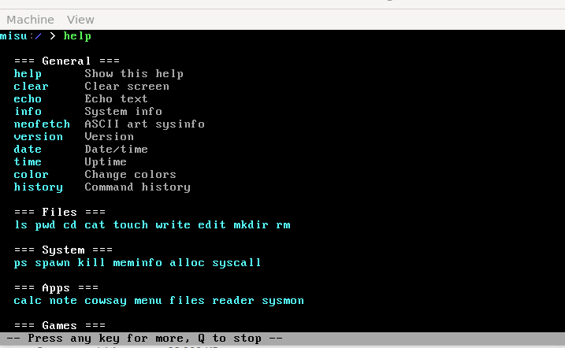

*Help command showing all available commands organized by category*

If you type an unknown command, the shell responds with an error message and suggests typing `help`.

---

## Filesystem

MisuOS has a ramdisk filesystem that supports files and directories. The filesystem is pre-populated at boot with a root directory containing `home/`, `bin/`, `etc/`, `tmp/`, `readme.txt`, `hostname`, and `version`.

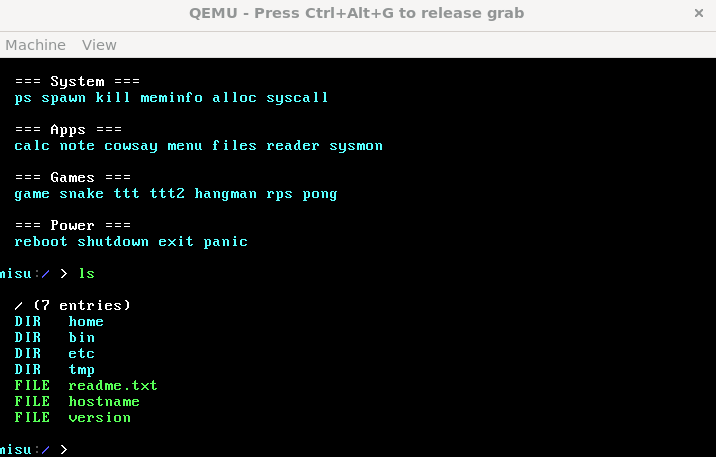

*Listing files and directories with color-coded types*

You can create files, write to them, read them, create directories, navigate between directories, and delete files.

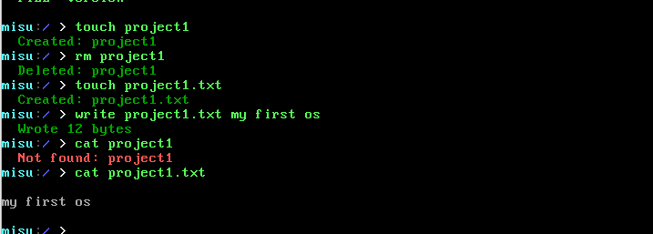

*Creating a file, writing to it, and reading it back*

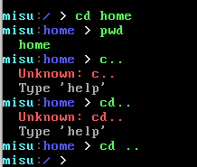

*Navigating between directories with cd, pwd, and cd ..*

Each file can hold up to 4KB of data. The filesystem supports up to 64 nodes (files and directories combined).

---

## Text Editor

The `edit` command opens a full-screen text editor. The filename appears in a cyan title bar at the top. You type to insert text, press Enter for new lines, Backspace to delete, and ESC to save and exit. If the file does not exist, it is created automatically.

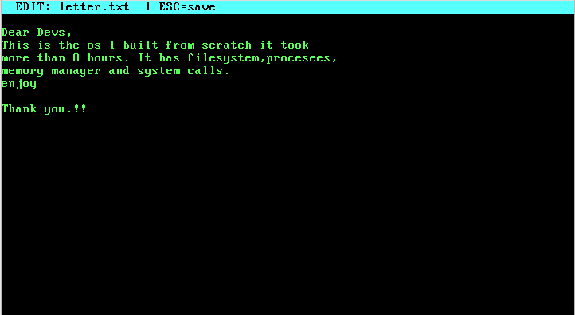

*Built-in text editor with title bar and save on ESC*

---

## Process Management

The OS maintains a process table with 16 slots. Each process has a Process Control Block containing a PID, name, state (RUNNING, READY, BLOCKED, TERMINATED), priority level, and CPU tick counter. At boot, two processes are created automatically: kernel (PID 0) and shell (PID 1).

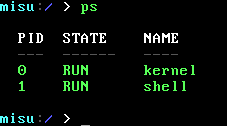

*Process table showing kernel, shell, and user-created processes*

The timer interrupt fires at 100Hz and calls `process_tick()` to track CPU usage for each process.

---

## Memory Management

The physical memory manager uses a bitmap allocator where each bit represents one 4KB page of RAM. At boot, the manager parses the Multiboot memory map provided by GRUB, marks all available regions as free, and reserves the kernel's own memory pages.

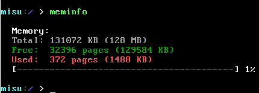

*Memory statistics with visual usage bar*

---

## System Calls

MisuOS implements five system calls accessible via `int 0x80`. Arguments are passed in CPU registers following the convention: EAX = system call number, EBX = first argument, ECX = second argument, EDX = third argument. The return value is placed in EAX.

| System Call | Number | Arguments | Returns | Description |
|-------------|--------|-----------|---------|-------------|
| write | 4 | fd, buffer, nbytes | bytes written | Write to stdout (fd=1) or stderr (fd=2) |
| read | 3 | fd, buffer, nbytes | bytes read | Read from keyboard (fd=0) |
| mkdir | 39 | dirname | 0 or -1 | Create a directory |
| getpid | 20 | none | PID | Return current process ID |
| uptime | 100 | none | ticks | Return timer ticks since boot |

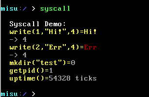

*Live demonstration of all five system calls with return values*

---

## Neofetch

The `neofetch` command displays system information alongside ASCII cat art, including OS name, kernel version, uptime, shell version, memory usage, process count, file count, and a 16-color palette display.

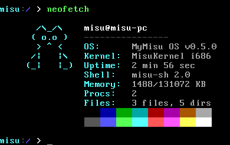

*Neofetch showing system information with ASCII cat art*

---

## Cowsay

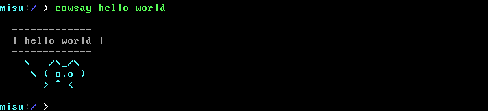

*The MisuOS cat delivering a message*

---

## Games

MisuOS includes seven built-in games.

| Command | Game | Controls |
|---------|------|----------|
| `snake` | Snake | Arrow keys to move. Eat food to grow. Avoid walls and yourself. ESC to quit. |
| `ttt` | Tic-Tac-Toe vs CPU | Press 1-9 to place X. CPU plays O with win/block AI strategy. |
| `ttt2` | Tic-Tac-Toe (2 Player) | Two players alternate. Player 1 = X, Player 2 = O. Press 1-9. |
| `hangman` | Hangman | Guess letters to reveal an OS-themed word. 6 lives. |
| `rps` | Rock Paper Scissors | Press r, p, or s. Best of 5 rounds against CPU. |
| `pong` | Pong (2 Player) | Player 1: W/S. Player 2: I/K. Q to quit. First to 5 wins. |
| `game` | Number Guessing | Guess a number between 1 and 20. You have 5 attempts. |

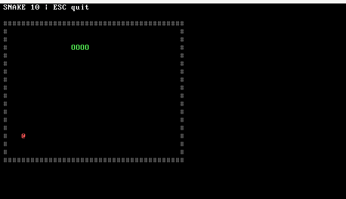

*Snake game running in MisuOS*

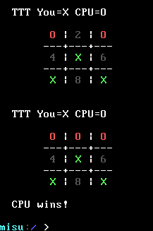

*Tic-Tac-Toe against the CPU*

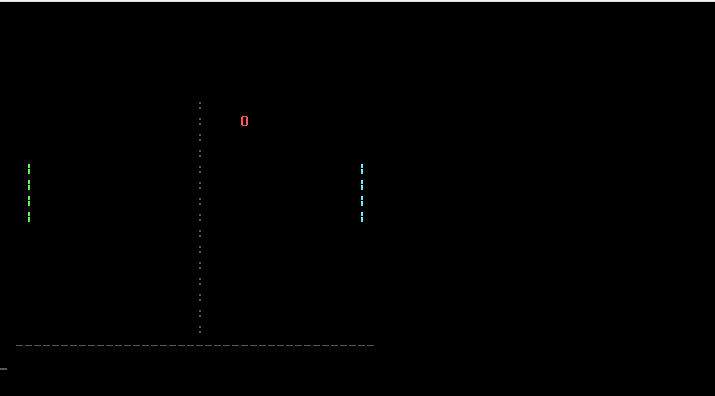

*Two-player Pong*

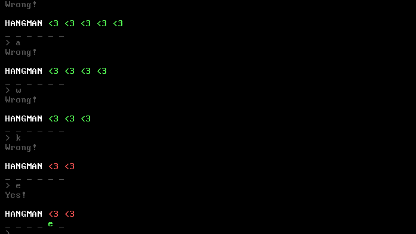

*Hangman with OS-themed words*

---

## Visual Applications

### Main Menu

Type `menu` to open a bordered full-screen menu. Navigate with UP/DOWN arrow keys and press ENTER to launch any application or game. Press ESC to return to the shell.

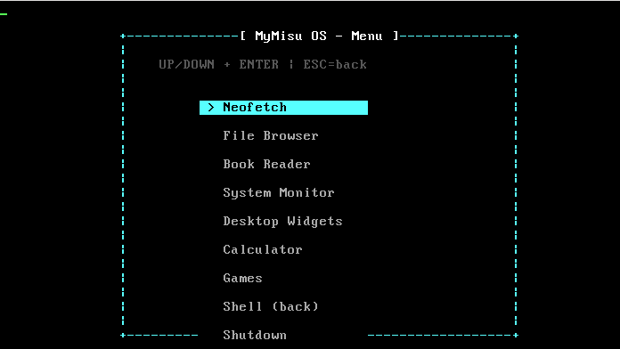

*Visual main menu with arrow key navigation*

### File Browser

Type `files` to open a visual file browser. Navigate with UP/DOWN arrows. Press ENTER to open files or enter directories. Press BACKSPACE to go up. Press N to create a new file, D to delete, ESC to exit.

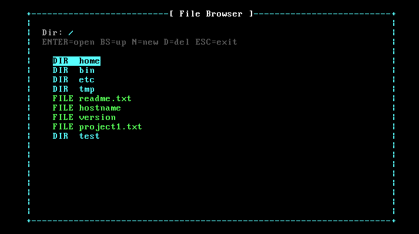

*Visual file browser with directory navigation*

### System Monitor

Type `sysmon` to open a live-updating system dashboard showing OS version, real-time clock, uptime, memory usage bar, process table, and filesystem statistics. Refreshes automatically every 500 milliseconds.

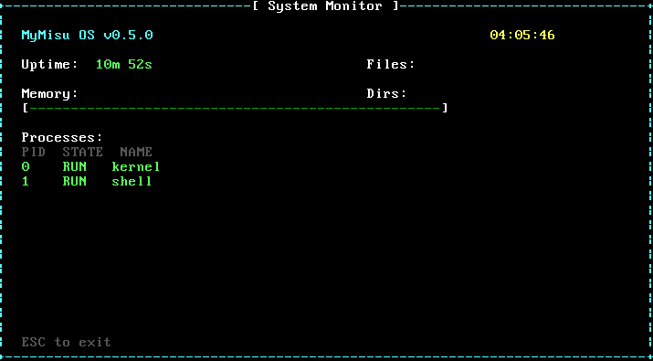

*Live system monitor dashboard*

### Desktop Widgets

Type `widgets` to open a widget dashboard with a large digital clock, date, system statistics, rotating programming quotes, and cat ASCII art. Refreshes every second.

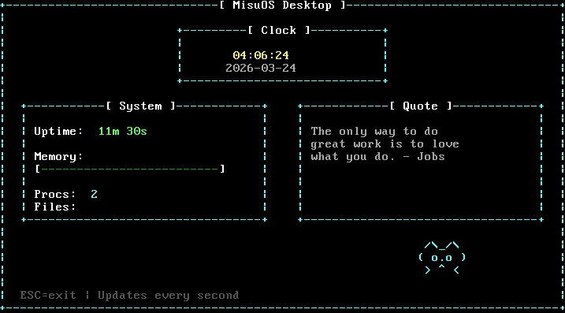

*Desktop widgets with clock, stats, and quotes*

---

## Kernel Panic

The `panic` command triggers a kernel panic, displaying a white-on-red error message and halting the CPU. This demonstrates the OS exception handling behavior.

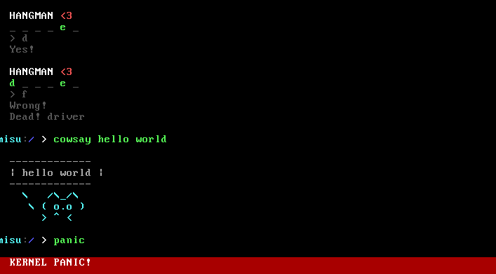

*Kernel panic screen*

---

## Complete Command List

### General

| Command | Description |
|---------|-------------|
| `help` | Show all available commands with pager support |
| `clear` | Clear the screen |
| `echo <text>` | Print text to the screen |
| `info` | Display detailed system information |
| `neofetch` | System info with ASCII cat art and color palette |
| `version` | Show OS version, kernel, shell, and compiler details |
| `date` | Show current date and time from hardware RTC |
| `time` | Show uptime since boot |
| `color <fg> <bg>` | Change terminal colors (values 0-15) |
| `history` | Show previous commands |

### Files and Directories

| Command | Description |
|---------|-------------|
| `ls` | List files and directories in current directory |
| `pwd` | Print current directory name |
| `cd <dir>` | Change directory (supports `cd ..` and `cd /`) |
| `cat <file>` | Display file contents |
| `touch <file>` | Create an empty file |
| `write <file> <text>` | Write text to a file |
| `edit <file>` | Open file in text editor (ESC to save) |
| `mkdir <dir>` | Create a directory |
| `rm <n>` | Delete a file or empty directory |

### Processes and Memory

| Command | Description |
|---------|-------------|
| `ps` | List all processes with PID, state, and name |
| `spawn <n>` | Create a new process |
| `kill <pid>` | Terminate a process by PID |
| `meminfo` | Display memory statistics with visual usage bar |
| `alloc` | Allocate one 4KB physical memory page |
| `syscall` | Run live system call demonstration |

### Applications

| Command | Description |
|---------|-------------|
| `calc <n> <op> <n>` | Calculator (supports +, -, *, /) |
| `note <text>` | Save a note (or view all notes with no arguments) |
| `cowsay <text>` | ASCII cat speaks your message |
| `menu` | Visual main menu with arrow key navigation |
| `files` | Visual file browser |
| `reader` | Page-by-page book reader |
| `sysmon` | Live system monitor dashboard |
| `widgets` | Desktop widgets with clock, stats, and quotes |

### Power

| Command | Description |
|---------|-------------|
| `reboot` | Restart the operating system |
| `shutdown` | Halt the system |
| `poweroff` | Halt the system |
| `exit` | Halt the system |
| `panic` | Trigger a kernel panic (white on red, system halts) |

---

## System Architecture

```
+---------------------------------------------+
|              User Interface                  |
|   Shell - Commands - Games - UI Apps         |
+---------------------------------------------+
|             Kernel Services                  |
|   Memory Manager - VGA - kprintf - Strings   |
+---------------------------------------------+
|              Kernel Core                     |
|   IDT/ISR - IRQ - PIC - Timer - Keyboard     |
+---------------------------------------------+
|              Boot Layer                      |
|   GRUB Multiboot - boot.s - GDT - Protected |
+---------------------------------------------+
|              Hardware                        |
|   x86 CPU - VGA - PS/2 - RAM - PIC 8259     |
+---------------------------------------------+
```

---

## Technical Details

| Property | Value |
|----------|-------|
| Architecture | x86 (i686), 32-bit protected mode |
| Bootloader | GRUB 2 via Multiboot specification |
| Display | VGA text mode, 80 columns x 25 rows, 16 colors |
| Input | PS/2 keyboard, US QWERTY layout, extended scancodes |
| Timer | Intel 8253 PIT at 100Hz |
| Interrupts | 256 IDT entries, PIC remapped to IRQ 32-47 |
| Memory | Bitmap physical page allocator, 4KB pages |
| Filesystem | In-memory ramdisk, 64 nodes, 4KB max per file |
| Processes | 16-slot process table with PCB |
| System Calls | 5 calls via int 0x80 (write, read, mkdir, getpid, uptime) |
| Compiler | GCC 13.2.0 (i686-elf cross-compiler) |
| Assembler | NASM |
| ISO Tool | grub-mkrescue with xorriso |
| Lines of Code | Approximately 3000 (C + Assembly) |

---

## Source Files

```
myMisu_OS/
  src/
    boot.s            Multiboot entry point (assembly)
    kernel.c          Kernel main, boot animation
    vga.c / vga.h     VGA text mode driver (80x25, 16 colors)
    gdt.c / gdt.h     Global Descriptor Table
    gdt_flush.s       GDT loader (assembly)
    idt.c / idt.h     Interrupt Descriptor Table (256 entries)
    isr.s             ISR and IRQ stubs (assembly)
    timer.c / timer.h PIT timer at 100Hz
    keyboard.c / .h   PS/2 keyboard with extended scancode support
    shell.c / shell.h Shell, commands, games, UI applications
    pmm.c / pmm.h     Physical memory manager (bitmap, 4KB pages)
    fs.c / fs.h       Ramdisk filesystem (64 nodes, files + dirs)
    process.c / .h    Process management (16 PCBs)
    syscall.c / .h    System call interface (int 0x80)
    string.c / .h     String utilities (strlen, strcmp, memcpy, etc)
    kprintf.c / .h    Formatted printing (%s, %d, %x, %c)
    ports.h           I/O port read/write helpers
    multiboot.h       Multiboot information structures
  iso/boot/grub/
    grub.cfg          GRUB bootloader configuration
  linker.ld           Kernel memory layout (loaded at 1MB)
  Makefile            Build system
```

---

<div align="center">

```
       /\_/\
      ( o.o )
       > ^ <
```

**MyMisu OS** — Built from nothing. Boots on everything.

</div>
