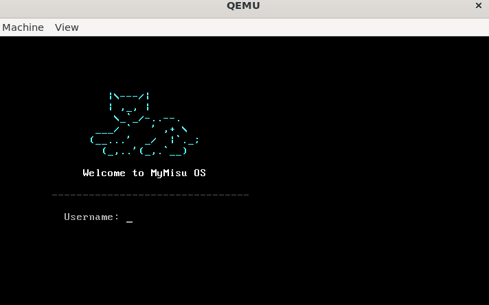

# MyMisu OS

**A bare-metal x86 operating system, built from scratch in C and Assembly**

*MyMisu OS login screen, boots on real hardware via USB*

---

## About

MyMisu OS is a fully functional x86 operating system that runs directly on hardware with no underlying OS, runtime, or standard library. Written entirely in C and x86 assembly, compiled with a freestanding GCC cross-compiler, and booted via GRUB Multiboot.

Version 2.0.0 introduces a real preemptive scheduler with assembly context switching, expands the system call interface from 5 to 19 calls with POSIX error codes, adds a file descriptor table for fd-based I/O, and ships with a live top command showing process state in real time.

Named after Misu, a cat.

---

## What's New in v2.0.0

- Real preemptive scheduler with round-robin scheduling and x86 assembly context switching
- 19 system calls (up from 5) with POSIX error codes matching Linux i386 errno values
- File descriptor table (16 fds) with O_RDONLY / O_WRONLY / O_CREAT / O_TRUNC / O_APPEND
- Live top command, color-coded process viewer, refreshes every 500ms
- Spawnable demo tasks (counter, spinner, ticker) to demonstrate concurrency
- Auto-versioning, version derived from git commit count on every build

---

## Download and Run

Download mymisu.iso from the Releases page.

Run in QEMU:
qemu-system-i386 -cdrom mymisu.iso -m 128M

Boot on real hardware: flash the ISO to a USB drive with Rufus, then boot from USB.

Login: misu / misu (or admin / admin, or james / 1234)

---

## System Architecture

Five-layer monolithic kernel design:

- User Interface: Shell, commands, games, UI apps
- Kernel Services: Memory manager, VGA driver, kprintf, string utils
- Kernel Core: IDT/ISR, IRQ handlers, PIC, timer, keyboard
- Boot Layer: GRUB Multiboot, boot.s, GDT, protected mode entry
- Hardware: x86 CPU, VGA, PS/2, RAM, PIC 8259

---

## Process Management

Process table with 16 slots. Each PCB contains PID, name, state, saved stack pointer, kernel stack, priority, tick counter, and wake-tick.

States: RUNNING, READY, BLOCKED, TERMINATED, UNUSED.

The scheduler runs every 100ms (every 10 timer ticks). Round-robin selection of next READY process. Context switch is six x86 instructions in src/context_switch.s.

Demo tasks: spawn counter, spawn spinner, spawn ticker, spawn all.

Use top to watch them rotate through states with live CPU%.

---

## System Calls

19 syscalls accessible via int 0x80, Linux i386 register convention.

Implemented: exit, read, write, open, close, unlink, chdir, stat, lseek, getpid, kill, mkdir, rmdir, uptime, yield, sleep, getcwd.

Stubbed (return -ENOSYS): fork, execve, waitpid.

Run the syscall command from the shell to see all 19 fire with PASS/FAIL output.

---

## Filesystem

Ramdisk filesystem, up to 64 nodes (files or directories), 4 KB max per file.

POSIX-style fd-based API in v2.0.0:
int fd = fs_open("notes.txt", O_CREAT | O_WRONLY);
fs_write_fd(fd, "hello", 5);
fs_close(fd);
Version is auto-generated from git commit count by gen_version.sh on every build.

---

## Project Info

- Course: CPS 5520 Computer System and Concepts
- Semester: Spring 2026
- Instructor: Juan Li
- Team: James Mardi, Danny Munoz, Kyle Humlen
- AI Tool: Claude (Anthropic)

---/\_/\
  ( o.o )
   > ^MyMisu OS v2.0.0, built from nothing, boots on everything.
